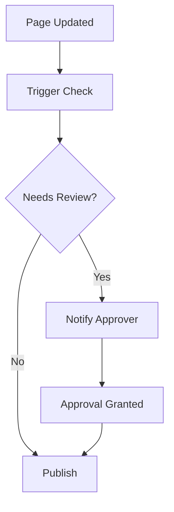

## Overview

Paperguide lets you tailor your documentation space to match your brand and team workflows. Access the configuration panel from your workspace settings to adjust theme, permissions, automation, and exports.

<Columns cols={2}>
  <Card title="Theme & Branding" icon="palette" href="#theme-branding">
    Set colors, logos, and fonts to reflect your identity.
  </Card>
  <Card title="User Permissions" icon="shield" href="#user-permissions">
    Control access levels for viewers, editors, and admins.
  </Card>
  <Card title="Workflow Automation" icon="zap" href="#workflow-automation">
    Automate approvals, notifications, and updates.
  </Card>
  <Card title="Export Options" icon="download" href="#export-options">
    Generate PDFs, HTML sites, or API exports.
  </Card>
</Columns>

## Theme and Branding

Customize the visual appearance of your Paperguide space to align with your brand.

<Steps>
  <Step title="Set Primary Color" icon="palette">
    Navigate to Settings > Theme. Enter your brand color, such as `#3B82F6`.

    ```json
    {
      "primaryColor": "#3B82F6",
      "secondaryColor": "#1E40AF"
    }
    ```
  </Step>
  <Step title="Upload Logo" icon="image">
    Drag and drop your logo (PNG or SVG, max 2MB). It appears in the header and sidebar.
  </Step>
  <Step title="Choose Font" icon="type">
    Select from Google Fonts or upload custom. Preview changes live.
  </Step>
</Steps>

<Callout kind="tip">
  Test your theme across light and dark modes before saving.
</Callout>

## User Permissions

Define roles to secure your documentation. Use granular controls for teams.

| Role       | View | Edit | Admin | Invite Users |
|------------|------|------|-------|--------------|
| Viewer    | ✅   | ❌   | ❌    | ❌           |
| Editor    | ✅   | ✅   | ❌    | ❌           |
| Admin     | ✅   | ✅   | ✅    | ✅           |

<Expandable title="Advanced Permission Rules" default-open="false">

Configure via JSON for custom rules:

<CodeGroup tabs="JSON,YAML">
```json
{
  "roles": {
    "editor": {
      "pages": ["read", "write"],
      "comments": "write"
    }
  }
}
```
```yaml
roles:
  editor:
    pages: [read, write]
    comments: write
```
</CodeGroup>

</Expandable>

## Workflow Automation

Streamline reviews and updates with triggers and actions.



Set up automations in the Workflow tab.

<Tabs>
  <Tab title="Notifications" icon="bell">
    Send Slack or email on page changes.

    ```javascript
    // Example webhook payload
    const payload = {
      event: 'page.updated',
      pageId: 'doc-123',
      user: 'editor@example.com'
    };
    ```
  </Tab>
  <Tab title="Approvals" icon="check-circle">
    Require 2 approvals for public pages.

    <Callout kind="info">
      Enable multi-approver mode for compliance.
    </Callout>
  </Tab>
</Tabs>

## Export Options

Export your documentation in multiple formats for sharing or archiving.

<CodeGroup tabs="PDF,HTML,Markdown">
```bash
# PDF via CLI
paperguide export --format=pdf --output=./docs.pdf
```
```bash
# HTML static site
paperguide export --format=html --output=./site/
```
```bash
# Markdown bundle
paperguide export --format=md --output=./export/
```
</CodeGroup>

<Columns cols={3}>
  <Card title="PDF" icon="file-text">
    Print-ready with custom cover pages.
  </Card>
  <Card title="HTML" icon="globe">
    Deployable static site with search.
  </Card>
  <Card title="API" icon="api" href="/docs/api/export">
    JSON endpoints for integrations.
  </Card>
</Columns>