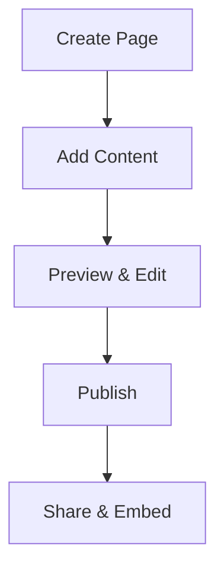

## What is Paperguide?

Paperguide is a modern documentation platform that helps you create, organize, and publish project documentation with ease. You build structured knowledge bases using MDX, collaborate with your team, and deliver polished docs to users. Unlike traditional wikis, Paperguide offers full Markdown and JSX support, custom themes, and seamless search integration.

This space serves as your central hub for all project docs. Organize content into collections, add version history, and embed interactive components like code examples and diagrams.

<Callout kind="info">
  Paperguide supports unlimited pages and teams, with instant search across all your documentation.
</Callout>

## Core Features

Paperguide provides powerful tools to streamline your documentation workflow.

<Columns cols={3}>
  <Card title="MDX & Components" icon="code" href="/docs/mdx-guide">
    Write rich docs with JSX components, code highlighting, and custom layouts. No limitations on interactivity.
  </Card>
  <Card title="Version Control" icon="git-branch" href="/docs/versions">
    Track changes, publish releases, and maintain multiple doc versions for different product stages.
  </Card>
  <Card title="Collaboration" icon="users" href="/docs/team">
    Invite team members, assign roles, and review edits in real-time.
  </Card>
</Columns>

## Why Choose Paperguide?

You select Paperguide for its speed, flexibility, and developer-friendly features. It outperforms static site generators by offering live previews, API-driven updates, and native search without external services. Teams report `<50%` faster doc creation and higher user satisfaction.

Key benefits include:
- Customizable themes matching your brand (e.g., primary color `#3B82F6`)
- Built-in analytics for doc usage
- Export to PDF, HTML, or Markdown

<Expandable title="Advanced Benefits" default-open="false">
  Integrate with GitHub for automatic syncs. Use webhooks to trigger builds on code pushes. Embed docs in your app via iframes or SDK.
</Expandable>

## Getting Started

Set up your Paperguide space in minutes. Follow these steps to create your first documentation site.

<Steps>
  <Step title="Create Account" icon="user-plus">
    Sign up at `paperguide.com` and verify your email. Choose a workspace name for your project.
  </Step>
  <Step title="Add Your First Page" icon="file-plus">
    Click "New Page" and select MDX template. Start editing with the live preview.
  </Step>
  <Step title="Install SDK (Optional)" icon="package">
    Enhance your docs with the JavaScript SDK for embeds and analytics.

    <CodeGroup tabs="npm,yarn">
      ```bash
      npm install @paperguide/sdk
      ```
      ```bash
      yarn add @paperguide/sdk
      ```
    </CodeGroup>
  </Step>
  <Step title="Publish" icon="rocket">
    Save and hit "Publish". Share your docs via custom domain or embed code.

    ```jsx
    <iframe
      src="https://yourspace.paperguide.com/embed"
      width="100%"
      height="600px"
    />
    ```
  </Step>
</Steps>

## Platform-Specific Setup

Customize setup for your environment.

<Tabs>
  <Tab title="Next.js Integration" icon="nextjs">
    Add Paperguide to your app for dynamic docs.

    ```tsx
    import { PaperguideProvider } from '@paperguide/sdk/next';

    export default function App({ Component, pageProps }) {
      return (
        <PaperguideProvider apiKey="your-api-key">
          <Component {...pageProps} />
        </PaperguideProvider>
      );
    }
    ```
  </Tab>
  <Tab title="GitHub Actions" icon="github">
    Automate doc deploys.

    ```yaml
    name: Deploy Docs
    on: [push]
    jobs:
      deploy:
        runs-on: ubuntu-latest
        steps:
          - uses: actions/checkout@v4
          - run: npx paperguide deploy
    ```
  </Tab>
</Tabs>



Your documentation is now live. Explore advanced topics like custom components and SEO in dedicated guides.